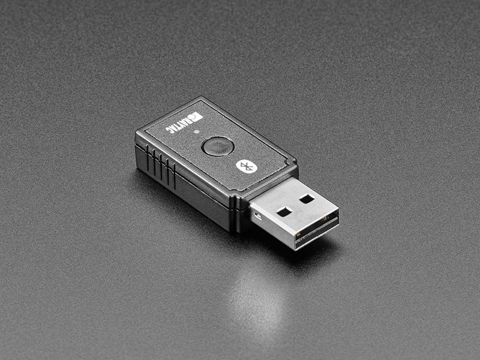
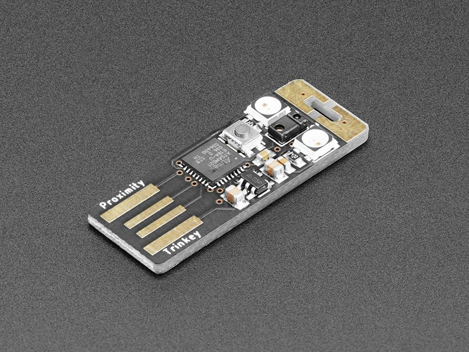
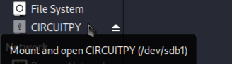

# cheap-ducky

this is how you can creat your very own rubber ducky like, usb with circuitpython and a couple of hid compatible usb boards 

the boards i used :

1- MDBT50Q-RX 

if you want things to be easy setting up this board you should get it from adafruit (https://www.adafruit.com/product/5199) because it will come with bootloader button working out of the box 

2- proximity trinkey

you can get this board from adafruit (https://www.adafruit.com/product/5022) [to enter the bootloader mode in this board plug it in and press the button two times]
definitely 3d print custom cover for that board

3- rasperry pi pico 

the pico is already been made check out the awesome way to do it from: https://github.com/dbisu/pico-ducky 

i just created an easy way to change payloads 

this project is actually inspired by dbisu's pico-ducky project

## now let's get to how to set these boards up to work

- MDBT50Q-RX: pressing the bootloader button plug it and you should see it up in the bootloader mode drag and drop the circuitpython uf2 file included in its Directory and it should go down and come up again as CIRCUITPY device [only required one time]

- proximity trinkey: plug it in without pressing any button and then press the bootloader button two times while its in you should see it up in the bootloader mode 
drag and drop the circuitpython uf2 file included in its Directory and it should go down and come up again as CIRCUITPY device [only required one time]

- the following stuff works on any os except for the payload editing script works only on linux

so now you should have your board as a CIRCUITPY device so lets see how you can set it to run as an hid device

- this method is for the both

drag the adafruit_hid folder and drop it in the board's lib folder, now its an hid device and its ready for the attack

## parsing ducky payloads to circuitpython

- using (ducky_to_python.py) script you can write a normal ducky script and run ducky_to_python.py 

- ex.: [python3 ducky_to_python.py <DUCKY_PAYLOAD>] 

it doesn't matter what file contains the ducky script it can be a text file, then it will change it to a circuitpython code and save it in as a (code.py) file

drag and drop this file to the CIRCUITPY root Directory and it will run and now every time you plug it in any computer it will run the payload

## changing an existing payload

- the changing payload script (edit_payload.py) does not support windows,  only linux is supported (at least for now)

- the edit_payload.py script made to prevent the code.py from running when you plug in the board by deleting the (code.py) before it has a chance to run

there is a couple of steps to be done before it can work: [required one time]
  - first: in your (/media/<YOUR_USER_NAME>/) creat a file called CIRCUITPY 
  - second: plug in the board (not the one with script on it) just an empty CIRCUITPY board and stop with the mouse on top of the board name (CIRCUITPY) to find its id like that:

then change the (device_id) variable in the script to yours [without /dev] ex.: device_id = 'sdb1'

thats it ! now to edit a payload just run the script before you plug in the board and then plug the board in and it will delete it before it runs 

or if you want to just check if there's a payload or not do the same and if there is not the script will tell you.

## Important notes about (ducky_to_python.py) script

- if injecting three keys at a time the character must be uppercase ex.: CTRL ATL T (popping terminal on linux)

- if injecting two keys at a time the character  must be lowercase ex.: GUI r (popping 'run' on windows )

- injecting two (Keycodes) at a time is supported ex.: CTRL SPACE (popping terminal in macOS)

- injecting three (Keycodes) at a time is supported ex.: ALT TAB LEFT

- don't use (-) with three keys at a time in the ducky script ex.1: (CTRL-ALT T) will not be parsed, ex.2: (CTRL ALT T) will be parsed   

- sometimes the script is buggie if you find a big amount of [kbd.send(None, SOMETHINGS)] delete them and it will be good to go

- the script does not support DEFAULT_DELAY ducky command

- obviously if you have a better ideas for the script ideas make it happen and hit me up with it !

## the easy way to change a payload on the pico:

- in the pico folder there is a (pico_to_ducky.py) script do the same steps described above to find the device_id and replace it with in the variable

- replace the other hardcoded variables with the (flash_script , circuitpyuf2 , hid_lib) to thier locations on your system

- now everytime you want to change a payload just run the script with the required arguments ex.: [python3 pico_to_ducky.py payload.dd duckyinpython.py]
and the script will do the work for you 

in my opinion the MDBT50Q-RX is the best choice because it looks just like a bluetooth adapter

- Hope you like the idea and it was useful for you ;)

 
